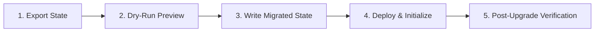

# EarnQuest Smart Contract - Backward Compatibility Policy

This document defines the official **Backward Compatibility Policy** for the EarnQuest Soroban smart contracts. It sets the engineering standards, versioning semantics, and migration requirements for evolving contract events and persistent storage schemas. 

All development team members and contributors must adhere to this policy to prevent state corruption, preserve off-chain indexing reliability, and ensure seamless contract upgrades.

---

## 📋 Table of Contents
1. [Overview & Scope](#-overview--scope)
2. [Event Compatibility Policy](#-event-compatibility-policy)
   - [Event Design System](#event-design-system)
   - [Allowed & Forbidden Changes](#allowed--forbidden-changes)
   - [Event Versioning Guidelines](#event-versioning-guidelines)
3. [Storage Schema Compatibility Policy](#-storage-schema-compatibility-policy)
   - [Storage Architecture overview](#storage-architecture-overview)
   - [Allowed & Forbidden Changes](#allowed--forbidden-changes-1)
   - [State Evolution Patterns](#state-evolution-patterns)
4. [State Migration Workflow](#-state-migration-workflow)
   - [Mandatory Dry-Run Preview](#mandatory-dry-run-preview)
   - [Migration Execution Process](#migration-execution-process)
   - [Rollback Plan Requirements](#rollback-plan-requirements)
5. [Testing & Verification Requirements](#-testing--verification-requirements)
   - [Continuous Compatibility Tests](#continuous-compatibility-tests)
   - [Upgrade Checklist](#upgrade-checklist)

---

## 🌐 Overview & Scope

The EarnQuest platform relies heavily on both **on-chain contract state** (for core consensus and security) and **off-chain indexed state** (subgraphs and custom indexers for user interfaces and analytics). 

Because Soroban smart contracts are upgradable, contract logic can be updated while retaining the original contract address and storage ledger. However, changes to either the **event structures** or the **storage layout** can easily break downstream systems or corrupt existing state.

This policy applies to:
- All event declarations, topic allocations, and emissions in [events.rs](file:///c:/Users/USER/Desktop/Projects/stellar_Earn/contracts/earn-quest/src/events.rs).
- All `DataKey` structures, storage layouts, and schema models defined in [storage.rs](file:///c:/Users/USER/Desktop/Projects/stellar_Earn/contracts/earn-quest/src/storage.rs) and [types.rs](file:///c:/Users/USER/Desktop/Projects/stellar_Earn/contracts/earn-quest/src/types.rs).
- Off-chain state migration tools, such as the [migrate-contract-storage.mjs](file:///c:/Users/USER/Desktop/Projects/stellar_Earn/scripts/deploy/migrate-contract-storage.mjs) utility.

---

## 📣 Event Compatibility Policy

Off-chain indexers and subgraphs process events asynchronously to construct the system's history and real-time state. Breaking event backward compatibility halts indexing and disrupts the user experience.

### Event Design System

All EarnQuest events must strictly follow the **Indexed Topic & Data Schema**:
- **Topics (Indexed)**: Up to 4 fields (including the event symbol name) stored as indexed ledger keys. Enabling efficient search and query patterns.
- **Data (Non-Indexed)**: Structured payloads stored as data values. Used for raw display after filtering.

> [!IMPORTANT]
> The order, type, and meaning of indexed fields in event topics form a strict contract with indexers. Any modifications must be treated as breaking.

---

### Allowed & Forbidden Changes

| Change Request | Category | Policy / Rationale |
| :--- | :---: | :--- |
| **Adding a brand new event** | ✅ **ALLOWED** | Safe. Old indexers will ignore the new event type until updated, while new indexers can immediately track it. |
| **Adding a field to Data payload (end of tuple)** | ✅ **ALLOWED** | Allowed only if the payload is represented as a structured map or at the end of a tuple where deserializers can handle variable lengths gracefully. |
| **Changing an event symbol name** | ❌ **FORBIDDEN** | Breaking. E.g., changing `quest_reg` to `q_registered` will cause indexers to miss all new quest creation events. |
| **Reordering event topics** | ❌ **FORBIDDEN** | Breaking. Reordering `[TOPIC, quest_id, creator]` to `[TOPIC, creator, quest_id]` causes indexers to filter by the wrong field values. |
| **Deleting an event or topic field** | ❌ **FORBIDDEN** | Breaking. Causes indexing exceptions, null-pointer errors, or missing historical data. |
| **Changing the type of a topic/data field** | ❌ **FORBIDDEN** | Breaking. Changing a field type (e.g. `u64` to `i128` or `Symbol` to `Address`) causes serialization failures. |

---

### Event Versioning Guidelines

When an event must undergo a breaking change, developers should utilize **Event Versioning**:

1. **Keep the old event** intact to preserve historical query paths.
2. **Define a new event** with an incremented suffix or distinct symbol name (e.g., `quest_reg_v2` or symbol `q_reg_v2`).
3. **Emit both events** (or route conditionally based on the contract version) during transition periods if downstream indexers require dual support.
4. **Document deprecation** in [EVENT_SPECIFICATION.md](file:///c:/Users/USER/Desktop/Projects/stellar_Earn/contracts/earn-quest/docs/EVENT_SPECIFICATION.md) at least one release cycle before removal.

---

## 💾 Storage Schema Compatibility Policy

Soroban contracts use persistent key-value storage. When the contract code is upgraded, the new WASM code is mapped to the existing storage ledger keys. Inconsistent storage key definitions or struct layout changes will lead to deserialization errors (`ContractError`) or state corruption.

### Storage Architecture Overview

EarnQuest implements a gas-optimized **split-storage pattern** to manage resource fees:
- **Hot Path**: High-frequency read/write fields stored in compact structs (e.g. `QuestMetadataCore`, `EscrowBalances`, `UserCore`).
- **Cold Path**: Large, low-frequency data stored in separate ledger keys (e.g. `QuestMetadataExtended`, `EscrowMeta`, `UserBadges`).

```mermaid
graph TD
    subgraph DataKey::Quest(ID)
        QuestStruct[Quest Data: ID, Creator, Status, Claims]
    end
    subgraph Hot Path Metadata
        DataKey::QuestMetadata[QuestMetadataCore: Title, Desc, Category]
    end
    subgraph Cold Path Metadata
        DataKey::QuestMetadataExt[QuestMetadataExtended: Requirements, Tags]
    end
```

---

### Allowed & Forbidden Changes

| Change Request | Category | Policy / Rationale |
| :--- | :---: | :--- |
| **Adding a new `DataKey` enum variant** | ✅ **ALLOWED** | Safe. The new storage key will be initialized to `None` or a default value for legacy entities. |
| **Adding optional fields to structs** | ✅ **ALLOWED** | Allowed *only* if the field has a default value or is wrapped in an `Option<T>` type to support legacy deserialization. |
| **Reusing or renaming `DataKey` variants** | ❌ **FORBIDDEN** | Breaking. Reusing a legacy key name for a new data structure causes immediate type deserialization crashes. |
| **Removing active `DataKey` keys** | ❌ **FORBIDDEN** | Breaking. Deleting active keys leaves orphaned state in the ledger or breaks core contract invariants. |
| **Changing struct field types in-place** | ❌ **FORBIDDEN** | Breaking. Causes the Soroban deserializer to crash when reading existing ledger entries. |

---

### State Evolution Patterns

When data models must evolve, developers must choose one of the following safe patterns:

#### Pattern A: Option Wrapping (No-Migration Schema Evolution)
Wrap the new field in an `Option` type. Legacy entries will read as `None`, which can be handled gracefully by contract logic.
```rust
#[contracttype]
pub struct QuestV2 {
    pub id: Symbol,
    pub creator: Address,
    // Added in v2: safe because legacy records resolve to None
    pub custom_label: Option<String>, 
}
```

#### Pattern B: Key Splitting (Hot/Cold Optimization)
If splitting a legacy struct is required (similar to splitting legacy `metadata` into `metadata_core` and `metadata_extended`), follow the **State Migration Workflow** below to perform a controlled structural upgrade.

---

## 🔄 State Migration Workflow

For major updates where structural schema upgrades are unavoidable, the migration must be prepared and verified off-chain using the dedicated Javascript migration utility.

### Mandatory Dry-Run Preview

Before writing any migrated artifact or committing to a deployment, developers **must** run the migration utility with the `--dry-run` flag. This parses the state snapshot and reports the exact actions to be taken without modifying any files.

```bash
# Mandatory dry-run preview command
node scripts/deploy/migrate-contract-storage.mjs --input state_backup_v1.json --dry-run
```

> [!TIP]
> Always check the console output of the `--dry-run` step to confirm that the counts of "Metadata splits", "Escrow splits", and "Platform stats normalizations" perfectly match expectations.

---

### Migration Execution Process

When the dry-run is verified, execute the migration and write the production-ready state snapshot using the following sequence:



1. **State Export**: Export the live state from the active contract:
   ```bash
   soroban contract invoke --id <OLD_CONTRACT_ID> --source admin-key --network public -- export_state > state_backup_v1.json
   ```
2. **Apply Migration**: Run the migration tool with the `--write` flag:
   ```bash
   node scripts/deploy/migrate-contract-storage.mjs --input state_backup_v1.json --output state_backup_v2.json --write
   ```
3. **WASM Deployment**: Deploy the new contract WASM binary.
4. **State Initialization**: Invoke the migration initialization entry point on the new contract:
   ```bash
   soroban contract invoke --id <NEW_CONTRACT_ID> --source admin-key --network public -- migrate_state --from-json state_backup_v2.json
   ```

---

### Rollback Plan Requirements

Every production migration plan must include a documented **Rollback Procedure** in case post-upgrade validation fails. 

The rollback plan must specify:
- [ ] **State Restoration Strategy**: The exact steps to redirect frontend client traffic back to the original `<OLD_CONTRACT_ID>`.
- [ ] **Data Drift Resolution**: A plan for identifying and resolving any user state changes that occurred during the brief window the new contract was active.
- [ ] **Backup Integrity**: The location of the verified `state_backup_v1.json` archive.

---

## 🧪 Testing & Verification Requirements

To ensure that developers do not accidentally introduce breaking changes, the contract test suite includes dedicated backward compatibility and simulated upgrade tests.

### Continuous Compatibility Tests

Every Pull Request must successfully execute the following cargo tests in [test_migration.rs](file:///c:/Users/USER/Desktop/Projects/stellar_Earn/contracts/earn-quest/tests/test_migration.rs):

1. **`test_function_signatures_remain_compatible`**:
   - Compiles contract interfaces and ensures all public endpoints maintain identical signatures (parameter names, types, and return values).
2. **`test_storage_schema_compatibility`**:
   - Simulates a contract upgrade in a mock environment.
   - Populates a mock ledger with legacy structures, performs a simulated WASM upgrade, and executes queries to verify that all data deserializes without errors.

```bash
# Execute backward compatibility verification
cargo test test_function_signatures_remain_compatible
cargo test test_storage_schema_compatibility
```

---

### Upgrade Checklist

Before merging any storage or event modifications, the author and reviewer must check off the following criteria:

- [ ] **Zero Regressions**: All 24/24 tests in the `test_migration` suite pass.
- [ ] **No In-Place Type Changes**: Any modifications to existing types are handled via `Option<T>` or designated key migrations.
- [ ] **Event Topics Intact**: No changes were made to existing event topic symbols, field order, or field types.
- [ ] **Dry-Run Validated**: The migration script has been tested using `--dry-run` on an exported mainnet/testnet state snapshot.
- [ ] **Documentation Updated**: If new events or storage fields were added, [EVENT_SPECIFICATION.md](file:///c:/Users/USER/Desktop/Projects/stellar_Earn/contracts/earn-quest/docs/EVENT_SPECIFICATION.md) and [MIGRATION_GUIDE.md](file:///c:/Users/USER/Desktop/Projects/stellar_Earn/contracts/earn-quest/MIGRATION_GUIDE.md) have been updated to reflect the new schemas.
