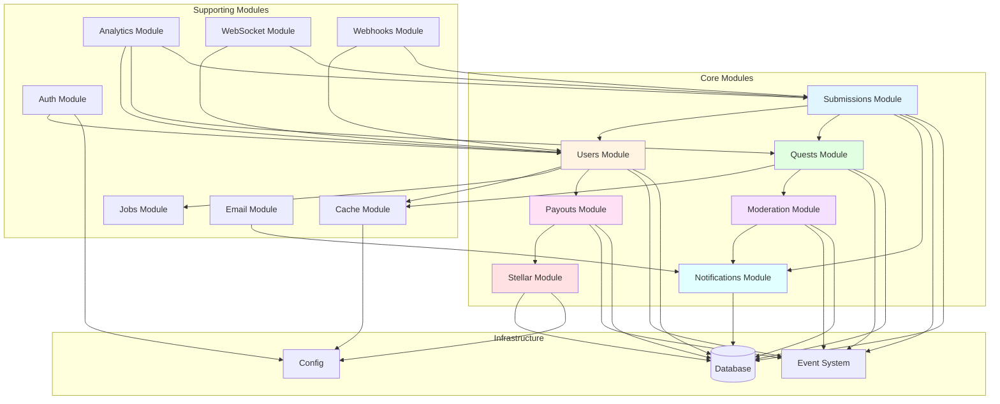
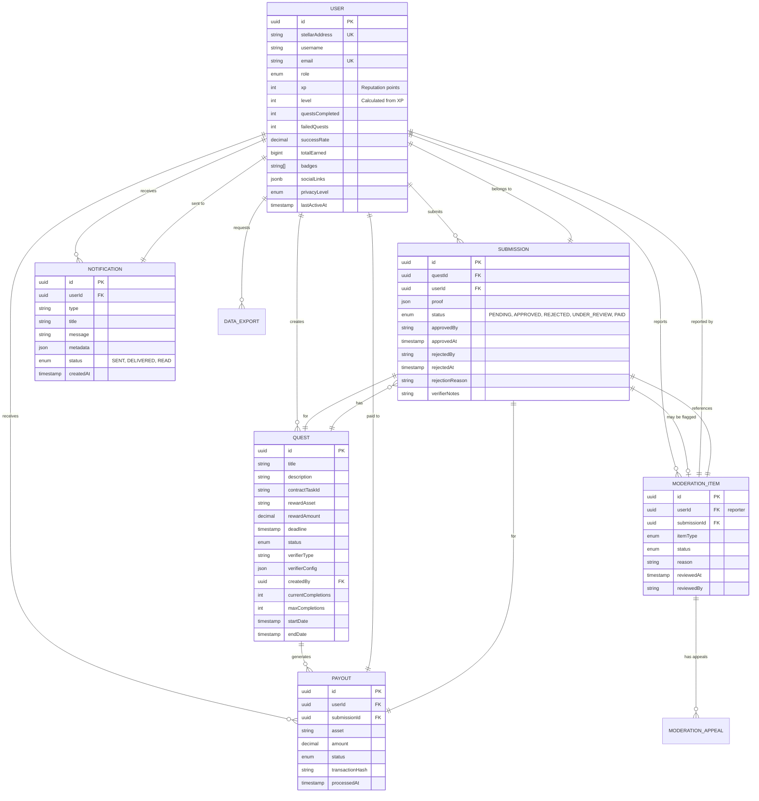
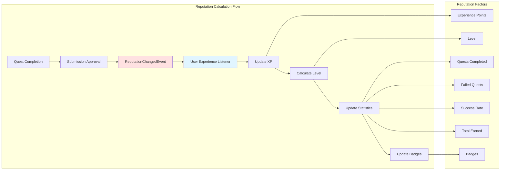
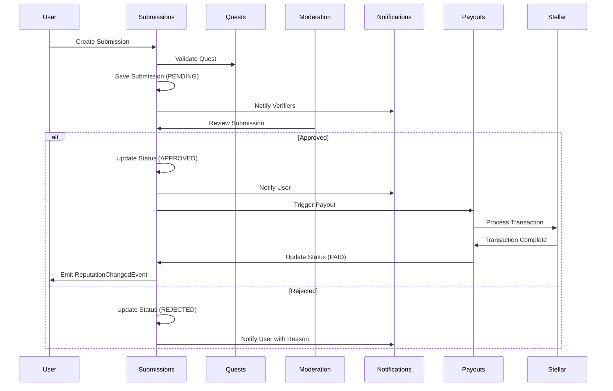
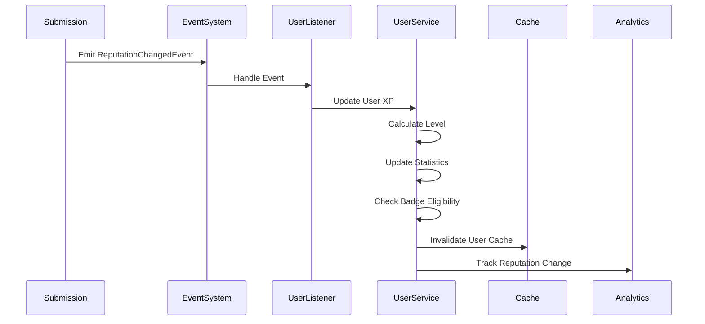
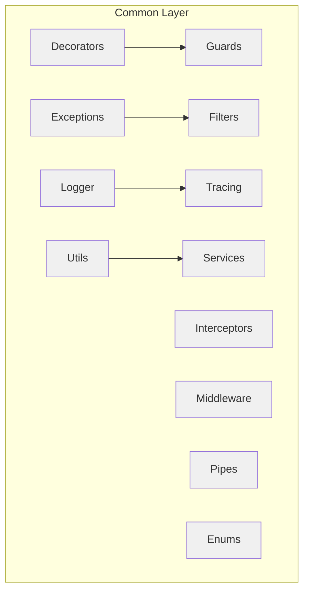
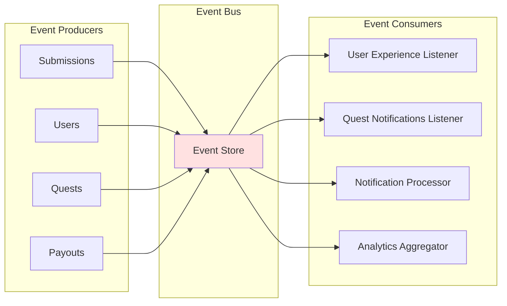
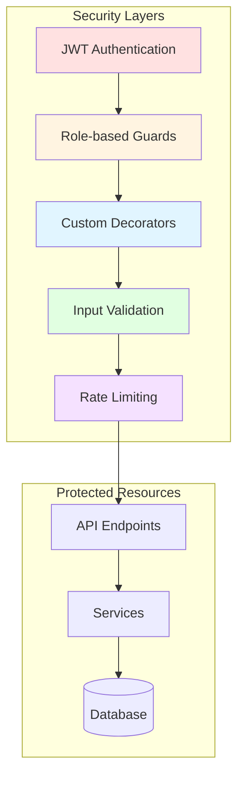

# Architecture Diagram

## System Overview

This document provides an architectural overview of the Stellar Earn application, focusing on the core modules and their interactions.

## Module Architecture

## Entity Relationships

## Reputation System Architecture

## Module Data Flow

### Submission Flow

### User Reputation Flow

## Module Responsibilities

### Core Modules

| Module            | Responsibility                                   | Key Entities                                           |
| ----------------- | ------------------------------------------------ | ------------------------------------------------------ |
| **Submissions**   | Manage quest submissions, verification workflow  | Submission, SubmissionStatus                           |
| **Users**         | User management, reputation system, gamification | User, DataExport, PrivacyLevel                         |
| **Quests**        | Quest creation, management, verification config  | Quest, QuestStatus                                     |
| **Payouts**       | Payment processing, Stellar integration          | Payout                                                 |
| **Moderation**    | Content moderation, appeals system               | ModerationItem, ModerationAppeal                       |
| **Notifications** | Multi-channel notification delivery              | Notification, NotificationLog, NotificationPreference  |
| **Stellar**       | Blockchain operations, multisig wallets          | MultisigWallet, MultisigTransaction, MultisigSignature |

### Supporting Modules

| Module        | Responsibility                             |
| ------------- | ------------------------------------------ |
| **Auth**      | Authentication, authorization, JWT tokens  |
| **Cache**     | Caching layer, cache strategies            |
| **Jobs**      | Background job processing, scheduled tasks |
| **Analytics** | Reporting, data aggregation, snapshots     |
| **Email**     | Email delivery, templates                  |
| **WebSocket** | Real-time communication                    |
| **Webhooks**  | External webhook delivery                  |

## Common Layer

The common layer provides shared functionality across modules:

## Event-Driven Architecture

The system uses an event-driven architecture for decoupled communication:

### Key Events

- **ReputationChangedEvent**: Fired when user reputation changes
- **QuestCreatedEvent**: Fired when a new quest is created
- **SubmissionStatusChangedEvent**: Fired when submission status changes
- **PayoutProcessedEvent**: Fired when a payout is completed

## Technology Stack

- **Backend Framework**: NestJS
- **ORM**: TypeORM
- **Database**: PostgreSQL
- **Blockchain**: Stellar
- **Cache**: Redis
- **Queue**: Bull (Redis-based)
- **Validation**: class-validator
- **Documentation**: Swagger/OpenAPI

## Security Architecture

## Scalability Considerations

1. **Horizontal Scaling**: Stateless services allow horizontal scaling
2. **Caching**: Redis cache reduces database load
3. **Queue System**: Background jobs processed asynchronously
4. **Event-Driven**: Decoupled modules via event system
5. **Database Indexing**: Strategic indexes on frequently queried fields
6. **Pagination**: All list endpoints support pagination

## Monitoring & Observability

- **Logging**: Structured logging with Winston
- **Tracing**: Distributed tracing support
- **Health Checks**: Health module for monitoring
- **Analytics**: Analytics module for business metrics
