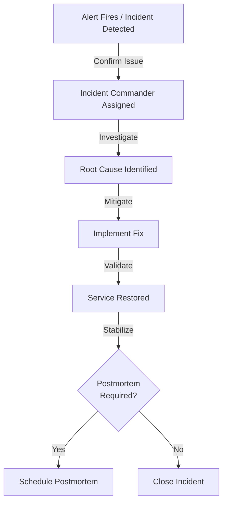

# Production Incident Postmortem Process & Workflow

## Overview

This document defines the process and workflow for conducting postmortems on production incidents at EarnQuest. The goal is to learn from incidents, prevent recurrence, and continuously improve system reliability.

**Key Principles:**
- **Blameless Culture:** Focus on systems and processes, not individuals
- **Psychological Safety:** Create an environment where people can speak openly
- **Data-Driven:** Use facts and logs, not assumptions
- **Actionable:** Generate items that will prevent recurrence
- **Transparent:** Share learnings across the organization

---

## Incident Classification

### Severity Levels

| Severity | Definition | Examples | Postmortem Required |
|----------|-----------|----------|---------------------|
| **Critical** | Complete service outage or data loss | Full API down, database corruption, data loss | **YES - Within 24 hours** |
| **High** | Significant degradation affecting users | 50%+ error rate, 10+ second latency | **YES - Within 48 hours** |
| **Medium** | Degradation but partial functionality | Single feature unavailable, 10-20% error rate | **YES - Within 1 week** |
| **Low** | Minor issue with minimal impact | Cosmetic bugs, slow dashboard | **Optional** |

### Incident Triggers for Postmortem

A postmortem should be triggered for incidents that:
- Impact availability of customer-facing features
- Cause data loss or corruption
- Breach SLA agreements
- Require emergency out-of-hours response
- Require rollback of a production deployment
- Affect internal systems for >1 hour

---

## Process Workflow

### Phase 1: Incident Detection & Response (During Incident)



**Responsibilities During Incident:**
- **Incident Commander (IC):** Drives response, coordinates team
- **Engineers:** Investigate and implement fixes
- **Manager:** Handles customer communication
- **On-call Lead:** Escalates if needed

**What to Document During Incident:**
- Slack channel dedicated to incident
- Timestamp of every action taken
- Key decisions and reasoning
- Any temporary workarounds
- When service was restored
- Customer notifications sent

---

### Phase 2: Postmortem Preparation (24-48 hours after incident)

#### Step 1: Declare Postmortem (Incident Commander)
- Determine severity
- Check if postmortem is required
- Schedule postmortem meeting (within required timeframe)
- Send calendar invites to required attendees

#### Step 2: Gather Initial Information (Incident Commander)
- Collect all logs from affected services
- Export metrics/dashboards from monitoring systems
- Collect client error reports/complaints
- Document timeline from Slack
- Save relevant alerting data
- Backup databases if data-related issue

**Key Information to Gather:**
```
├── Service Logs
│   ├── Application logs (ERROR, WARN levels)
│   ├── System logs (dmesg, kernel logs)
│   └── Audit logs (database, API calls)
├── Metrics & Monitoring
│   ├── CPU, memory, disk usage
│   ├── Request rate, error rate
│   ├── Response time, latency percentiles
│   └── Database query performance
├── Infrastructure
│   ├── Network connectivity
│   ├── Load balancer status
│   ├── Database replication lag
│   └── Caching layer health
├── Deployment
│   ├── Recent deployments
│   ├── Configuration changes
│   ├── Dependencies updates
│   └── Feature flags changed
└── Communication
    ├── Customer notifications
    ├── Slack thread
    ├── On-call escalations
    └── Status page updates
```

#### Step 3: Create Incident Record (Incident Commander)
- Create postmortem document from template
- Fill in incident overview section
- Fill in timeline section with gathered information
- Document initial observations

**Attendees to Include:**
- **Required:** Incident Commander, Primary Engineers, Team Lead
- **Strong recommendation:** Service Owner, On-call Engineer
- **Optional:** Customer Support (for customer impact details)
- **Optional:** Product/Management (for business impact)

---

### Phase 3: Postmortem Meeting (Timeline: 1-2 hours)

#### Pre-Meeting (15 minutes before)
- Reminder sent to attendees
- Postmortem document shared
- Video call link active
- Facilitator (usually Engineering Lead) ready

#### Meeting Agenda (Typical 60-90 minute format)

**1. Opening (5 minutes)**
- Facilitate introduces meeting
- Explain blameless culture
- Ground rules: everyone participates, focus on learning
- Meeting will be recorded and shared

**2. Incident Timeline Review (15 minutes)**
- IC walks through timeline
- Ask clarifying questions
- Fill in gaps in timeline
- Correct any inaccuracies

**3. Root Cause Analysis (20-30 minutes)**
- **Discuss:** What was the root cause?
- **Discuss:** Why wasn't this caught earlier?
- **Use 5 Why technique:**
  1. Why did the API go down? (DB connection pool exhausted)
  2. Why was the pool exhausted? (Long-running query locked)
  3. Why was there a long-running query? (Missing index)
  4. Why was the index missing? (Not tested under load)
  5. Why wasn't it tested? (No load testing before deployment)
- **Outcome:** Clear root cause documented

**4. Impact Discussion (10 minutes)**
- How many users were affected?
- What features were unavailable?
- How much revenue impact?
- SLA breach?
- Data integrity issues?

**5. Response Effectiveness (10 minutes)**
- What went well? (Call out positive behaviors)
- What could be improved? (Focus on processes, not people)
- Were there any response delays?
- Were there any miscommunications?

**6. Lessons Learned (10 minutes)**
- What should we start doing?
- What should we stop doing?
- What should we do more of?
- What should we do less of?

**7. Action Items (15 minutes)**
- Brainstorm preventive actions
- Prioritize by impact vs. effort
- Assign owners
- Set realistic due dates

**8. Closing (5 minutes)**
- Summarize action items
- Confirm owners understand their tasks
- Thank participants
- Schedule follow-up meeting for action item review

---

### Phase 4: Post-Incident Documentation (Day After Meeting)

#### Duties of Meeting Facilitator

**Within 24 hours:**
1. **Finalize postmortem document**
   - Complete root cause analysis section
   - Add detailed timeline with everyone's input
   - Document all action items with owners and dates
   - Add lessons learned section

2. **Document action items**
   - Create Jira/GitHub tickets for each action item
   - Link tickets in postmortem document
   - Add to incident prevention backlog
   - Prioritize as P0/P1/P2/P3

3. **Share postmortem**
   - Send to all attendees for final review
   - Announce in company Slack channel
   - Post to internal documentation site
   - Send to interested stakeholders

**Template Section to Complete:**
```markdown
## Action Items (Prevention & Process Improvements)

| ID | Action | Owner | Due Date | Priority | Ticket |
|----|--------|-------|----------|----------|--------|
| A1 | Add load test for query pattern | Alice | 2024-01-15 | P1 | JIRA-123 |
| A2 | Add monitoring alert for DB pool | Bob | 2024-01-12 | P1 | JIRA-124 |
| A3 | Create index on user_sessions table | Carol | 2024-01-10 | P0 | JIRA-125 |
```

---

### Phase 5: Follow-up & Closure (Ongoing)

#### Weekly Action Item Review
- Track progress on postmortem action items
- Update timeline in postmortem document
- Escalate blocked items
- Celebrate completed improvements

#### Action Item Tracking
```
Status:
- [ ] Not Started
- [ ] In Progress
- [ ] Blocked (reason)
- [ ] Completed
- [ ] Verified (fix prevents recurrence)
```

#### Postmortem Closure Criteria
A postmortem can be closed when:
1. Root cause is clearly understood
2. All action items are tracked in backlog
3. Prevention items are estimated and prioritized
4. Postmortem is approved by team lead
5. Postmortem is shared with relevant teams

---

## Roles & Responsibilities

### Incident Commander (IC)
**During Incident:**
- Coordinates all response activities
- Makes escalation decisions
- Communicates status to management
- Documents timeline

**During Postmortem:**
- Presents incident timeline
- Explains decisions made during incident
- Participates in root cause analysis

**After Postmortem:**
- Follows up on action items
- Verifies preventive measures are implemented

### Facilitator (Engineering Lead)
**Before Postmortem:**
- Schedules meeting within SLA
- Sends calendar invites
- Prepares facilitator notes
- Reviews initial timeline

**During Postmortem:**
- Opens with blameless culture reminder
- Keeps meeting on track
- Ensures everyone participates
- Guides discussion to prevent tangents
- Takes notes on decisions

**After Postmortem:**
- Finalizes document
- Creates action item tickets
- Shares findings widely
- Schedules follow-up

### Service Owner
**Before Postmortem:**
- Provides context on service importance
- Lists critical dependencies
- Explains recent changes

**During Postmortem:**
- Provides architectural context
- Helps trace root cause
- Commits to prevention items

**After Postmortem:**
- Supports implementation of fixes
- Verifies improvements

### Participants (Engineers, On-call)
**Before Postmortem:**
- Prepare notes on your actions during incident
- Think about what went well/wrong

**During Postmortem:**
- Describe what you did and why
- Ask clarifying questions
- Contribute to lessons learned
- Volunteer for action items

**After Postmortem:**
- Work on assigned action items
- Communicate progress

---

## Best Practices

### For a Blameless Postmortem

**DO:**
- ✅ Focus on systems and processes
- ✅ Ask "why" questions to understand context
- ✅ Acknowledge good decisions made with information available
- ✅ Assume good intentions
- ✅ Document learnings for future reference
- ✅ Celebrate what went well

**DON'T:**
- ❌ Blame individuals
- ❌ Assume people "should have known"
- ❌ Focus on who made the mistake
- ❌ Use it as a disciplinary meeting
- ❌ Dismiss concerns as "user error"
- ❌ Skip difficult conversations

### For Effective Root Cause Analysis

**Use the 5 Why Technique:**
```
Incident: Database connection pool exhausted

Why #1: Why was the pool exhausted?
→ Long-running queries locked the pool

Why #2: Why were there long-running queries?
→ A query wasn't using the correct index

Why #3: Why wasn't the correct index being used?
→ The index was never created

Why #4: Why wasn't the index created?
→ Our load test didn't reproduce this pattern

Why #5: Why didn't load testing catch this?
→ Load test data wasn't representative of production patterns
```

**Root Cause: Load testing doesn't use realistic data patterns**

---

## Post-Incident Metrics to Track

### Service Reliability Metrics
- Time to Detection (TTD): How long until incident was noticed
- Time to Mitigation (TTM): How long until impact was stopped
- Time to Resolution (TTR): How long until fully fixed
- Mean Time Between Failures (MTBF): How often incidents occur
- Mean Time to Recovery (MTTR): Average recovery time

### Postmortem Effectiveness
- Number of postmortems per month
- Average action items per postmortem
- Action item completion rate (%)
- Prevention: Similar incidents reduction
- Customer impact: Did improvements reduce severity?

---

## Examples & Resources

### Sample Postmortem Outcomes

**Good Outcomes:**
- Identified missing monitoring alert → Implemented alert → No recurrence
- Found code path not tested → Added unit tests → Bug fixed
- Caught configuration drift → Updated deployment process → Prevented future drift

**Poor Outcomes:**
- "Engineer error" → No process change → Incident recurs
- "System was slow" → Not investigated → Root cause unknown
- "Need better monitoring" → No specific action taken

### Tools & Integration

**Tools Used in Postmortem Process:**
- Incident management: PagerDuty / Incident.io
- Documentation: GitHub wiki / Confluence
- Metrics: Datadog / New Relic / Grafana
- Ticketing: Jira / GitHub Issues
- Communication: Slack / Email

**Integration Checklist:**
- [ ] Incident tool auto-creates postmortem record
- [ ] Postmortem template available in tool
- [ ] Metrics automatically attached to postmortem
- [ ] Action items auto-create Jira tickets
- [ ] Postmortems archived in searchable database

---

## Common Pitfalls & How to Avoid Them

| Pitfall | Impact | How to Avoid |
|---------|--------|------------|
| **Blame culture** | People stop reporting issues, learn nothing | Remind: focus on systems, not individuals |
| **No action items** | Incidents recur | Brainstorm, assign owners, create tickets |
| **Unrealistic timelines** | Items don't get done | Involve assignees in estimation |
| **No follow-up** | Improvements never materialize | Weekly tracking, status reports |
| **Incomplete analysis** | Root cause remains unknown | Keep asking "why" (5 whys) |
| **Only technical fixes** | Process issues repeat | Address both tech and process |
| **No wider sharing** | Organization doesn't learn | Publish postmortems widely |

---

## Templates & Checklists

### Incident Severity Decision Tree

```
Is there customer impact?
├─ YES: Is availability affected?
│  ├─ YES: Are 50%+ of features unavailable? → CRITICAL
│  ├─ YES: Is any feature unavailable? → HIGH
│  └─ NO: Is functionality degraded >10%? → MEDIUM
├─ YES: But only minor features? → LOW
└─ NO: Internal-only issue? → LOW (unless security)
```

### Pre-Postmortem Checklist

- [ ] Severity level confirmed
- [ ] Postmortem scheduled within SLA
- [ ] All attendees invited
- [ ] Incident logs collected
- [ ] Metrics exported
- [ ] Timeline drafted
- [ ] Postmortem template created
- [ ] Meeting facilitator assigned
- [ ] Video call link prepared
- [ ] Document shared with attendees

### Post-Postmortem Checklist

- [ ] Document complete and reviewed
- [ ] Action items assigned and tracked
- [ ] Jira tickets created
- [ ] Postmortem shared organization-wide
- [ ] Follow-up meeting scheduled
- [ ] Metrics tracked
- [ ] Learnings added to KB
- [ ] Runbooks updated if needed

---

## Integration with Monitoring & Alerting

### Monitoring Requirements After Postmortem

For each postmortem, ask:
1. **Detection:** Could we have detected this faster?
2. **Alerting:** Should we add a new alert?
3. **Thresholds:** Are alert thresholds appropriate?
4. **Observability:** Do we have enough metrics/logs?

**Monitoring Checklist:**
- [ ] Alert added for this condition
- [ ] Alert thresholds optimized
- [ ] Dashboard updated with new metrics
- [ ] Logging covers failure scenarios
- [ ] Tracing includes slow query tracking

---

## Success Criteria

A postmortem process is successful when:

✅ **Blameless culture is evident** - People speak openly without fear  
✅ **Root causes are clear** - Not just symptoms, but underlying issues  
✅ **Action items are specific** - Not vague, but actionable  
✅ **Items are tracked** - Not lost after meeting  
✅ **Improvements are implemented** - Items are completed and verified  
✅ **Incident rates decline** - Fewer recurrences of same issues  
✅ **Team learns** - Organizational knowledge grows  
✅ **Prevention improves** - Proactive measures increase  

---

## References

### Internal Resources
- [Incident Response Runbook](./RUNBOOK.md)
- [On-Call Guide](./ON_CALL_GUIDE.md)
- [Monitoring & Alerting](./MONITORING.md)
- [Postmortem Template](./POSTMORTEM_TEMPLATE.md)

### External Resources
- [Google's Postmortem Process](https://sre.google/resources/practices-and-processes/postmortem-culture/)
- [Blameless Postmortems](https://codeascraft.com/2012/05/22/blameless-postmortems/)
- [The Incident Commander Role](https://www.incident.io/blog/incident-commander-101)
- [SRE Book - Postmortems](https://sre.google/sre-book/postmortem-culture/)

---

## Revision History

| Version | Date | Author | Changes |
|---------|------|--------|---------|
| 1.0 | 2024-01-01 | Engineering Team | Initial creation |
